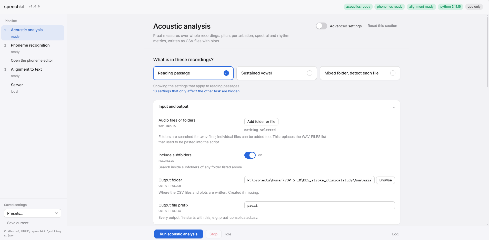
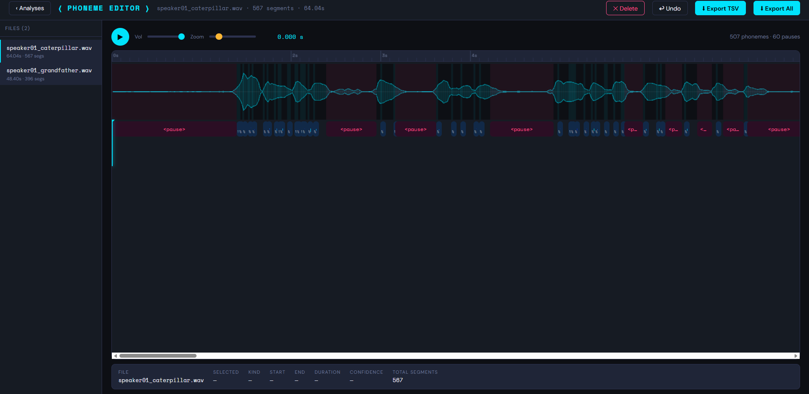

# speechkit

Acoustic analysis, phoneme recognition and phoneme-to-text alignment for speech
recordings, behind one local interface.

speechkit brings together three things researchers usually do with three
separate scripts. It measures a recording the way Praat would, it labels every
phoneme and pause in that recording, and it compares what a speaker actually
produced against the text they were asked to read. Each stage works on its own,
and together they describe one recording from waveform to per-phoneme accuracy.

It runs entirely on your own machine. No audio is uploaded anywhere.



*Choosing the recording type, which determines the settings shown below it.*



*Reviewing recognised phonemes: drag the boundaries, relabel, delete spurious
segments, export a corrected TSV.*

---

## What it does

**Acoustic analysis.** Runs Praat's measures over whole recordings through
[parselmouth](https://parselmouth.readthedocs.io/): pitch and its variability,
jitter, shimmer, HNR, CPPS, formants and vowel-space dispersion, speech and
articulation rate, pause structure, envelope modulation in the syllabic band,
intensity decay, and maximum phonation time for sustained vowels. Results come
out as CSV files plus a bar plot per metric. It handles two task types, reading
passages and sustained phonation, and can route each file automatically.

**Phoneme recognition.** Labels every phoneme with a wav2vec2 CTC model and
finds pauses with an adaptive threshold that needs no tuning to the room. Then
it opens a waveform editor in the browser where you can play the audio, drag
phoneme boundaries, relabel, delete spurious segments, and export a reviewed
TSV. Automatic phoneme recognition is not accurate enough to use unreviewed on
disordered speech, which is why the editor exists.

**Alignment to text.** Aligns the phonemes produced against the canonical
phoneme sequence for the passage using Needleman-Wunsch, groups them under the
word they belong to so substitutions and omissions are visible in place, marks
long pauses, and reports accuracy, substitutions, omissions and insertions per
session.

---

## Requirements

Python **3.10 to 3.13**. Use 3.11 or 3.12 if you are choosing: those have had
wheels for every dependency for a long time.

- Below 3.10, `librosa` cannot install, because `numba` dropped Python 3.9.
- On 3.14 and later, `librosa` needs `numba` 0.63 or newer and `torch` wheels
  may not exist yet.

Works on Windows, macOS and Linux. A GPU is optional; phoneme recognition is
perhaps five to ten times faster on one but runs fine on a CPU.

---

## Install

With conda, which is the easier route on Windows:

```bash
conda env create -f environment.yml
conda activate speechkit
```

With pip, into a Python 3.11 or 3.12 environment:

```bash
python -m venv .venv
source .venv/bin/activate          # Windows: .venv\Scripts\activate
pip install -r requirements.txt
```

Then check the install:

```bash
python -m speechkit env
```

That prints your Python version and, for each of the three stages, whether its
dependencies are present and which are missing. The interface shows the same
thing as chips along the top.

### Installing only part of it

The stages have separate dependencies, so you don't have to install a 1 GB
deep-learning framework to use the acoustic measures:

```bash
pip install -e ".[acoustics]"   # Praat measures only
pip install -e ".[phonemes]"    # phoneme recognition only
pip install -e ".[all]"         # everything
```

The alignment stage needs nothing beyond the standard library.

---

## Running it

```bash
python run_interface.py
```

Or equivalently `python -m speechkit`. On Windows you can double-click
`start_windows.bat`. A browser opens at <http://127.0.0.1:7331>.

Everything is set from the interface, including every input and output path, so
there is nothing to edit in the source. Settings are saved to
`~/.speechkit/settings.json` and reloaded next time.

---

## The pipeline, in order

Acoustic analysis is independent: point it at a folder of `.wav` files, choose
the recording type, and run it.

The recording type comes first and has no default. Reading passages and
sustained vowels run through different measurement code, and most of the window
and token settings are never read on a passage, so the panel asks what is in the
recordings before showing anything else. Choosing **reading passage** shows 22
acoustic settings, **sustained vowel** shows 38, and **mixed folder** shows all
40 and routes each file by its folder name, filename and then its acoustics. The
18 sustained-only and 2 reading-only settings can still be revealed from the
link under the picker, marked so you can see they will not be read.

From the command line the type is a flag:

```bash
python -m speechkit acoustics FOLDER -o OUT --task reading
python -m speechkit acoustics FOLDER -o OUT --task sustained_vowel
```

The phoneme path has three steps that must happen in order.

1. **Recognise.** Select your recordings and run the phoneme stage. It writes
   one `<recording>_auto.tsv` per file and loads them into the editor.
2. **Review.** Open the editor from the sidebar or the results table. Correct
   boundaries and labels, then export. This writes
   `<recording>_edited.tsv`.
3. **Align.** Run the alignment stage on the folder holding those TSV files.

If a recording has both an `_auto.tsv` and an `_edited.tsv`, alignment uses only
the reviewed one, so you never align the same recording twice.

> The editor reads whatever the last recognition run left in memory. If you
> restart the interface, open `/editor` directly, or run recognition from the
> command line, the editor will be empty. Run recognition from the interface in
> the same session you want to review in.

### Files the alignment stage needs

Recognition produces the TSV files, but the reference text is something you
supply, and **the TSV files have to end up next to it**. One rule:

> A session file is any `.tsv` in the same folder as `<passage>.txt` with the
> passage name somewhere in its filename.

The phoneme stage writes TSVs beside the audio, or into its own output folder,
so they need copying or moving into the passage folder. The name itself needs no
work: the TSV inherits its name from the recording, and both orderings are
recognised.

```
caterpillar_speaker01_edited.tsv       matches
speaker01_caterpillar_edited.tsv       matches
DBS_post_caterpillar_01_edited.tsv    matches
speaker01_recording_edited.tsv         does NOT match: no passage name
```

Two things the stage does to keep this from going quietly wrong. If one folder
mixes both orderings, the passage-first files win and the rest are reported as
ignored rather than dropped in silence. And a file naming two different passages
is skipped as ambiguous rather than assigned to a guess.

For each passage, its folder needs:

```
caterpillar/
  caterpillar.txt                              the reference text
  caterpillar_phonemes.txt                     the canonical phoneme sequence, space-separated IPA
  caterpillar_20260413_post-01_edited.tsv      one per session, from the editor
  caterpillar_20260413_post-02_edited.tsv
```

`caterpillar_phonemes.txt` holds the phoneme sequence for that exact wording,
with multi-character IPA tokens separated by spaces:

```
d uː j uː l aɪ k ə m j uː z m ə n t p ɑːɹ k s
```

If the file contains `===`, only the part after the last one is read, so you can
keep notes above the sequence.

Leave the passages field empty and every passage in the folder is discovered
automatically.

**Numbered segments.** If a session filename contains `-01`, `-02` and so on,
the aligner looks for a matching `caterpillar-01.txt` and
`caterpillar_phonemes-01.txt` and uses those for that session. This is for
protocols that split a passage into numbered chunks. Without a match, the
unnumbered files are used.

---

## Settings

Every value that used to be a constant edited in the source is in the
interface, grouped by what it affects, with the original explanation as help
text. Advanced settings are hidden behind a toggle.

Four are worth knowing about before your first real run.

**Recording type** has to be chosen before anything else, and deliberately has
no default. Set it to `reading` or `sustained_vowel` when a folder holds one
task, which is the safest option; `auto` is for a folder that genuinely holds
both.

**Pitch range** is the most consequential setting here. Set an octave wrong and
every file comes out looking aperiodic, with nothing in the output pointing at
the cause. The default derives one range for the batch and caches it to a JSON
file, so later sessions of the same subject reuse it exactly. Put that file in
the *subject* folder, above the per-session folders. For longitudinal work this
matters: with the range re-estimated per file, part of any pre/post difference
is a settings difference rather than a change in the voice.

**One production per file** should be on when your protocol is exactly one
passage or one sustained vowel per recording. It treats the whole speech span as
the production, so a dropout inside a take is reported by the coverage ledger
instead of becoming a second token.

**Usability gates** imply a geometry worth checking. With non-overlapping
windows, a take needs `valid windows x window length + 2 x edge trim` seconds of
perfectly steady phonation to pass at all, and every rejected slot costs another
window length. Look at `sv_analyzed_fraction` and `sv_steady_frame_fraction`
before lowering them: if the frames are steady and the gate still fails, the
gate is the problem, not the voice.

**Passage syllable counts** make the speech rate exact rather than estimated,
and the shipped counts are for one specific wording of each passage. Check them
against yours. A wrong count biases the rate for every file of that passage.
The `speaking_time_fraction` metric does not depend on them.

Use the presets box in the sidebar to save a whole configuration by name, which
is the easiest way to keep one setup per study arm or per subject group.

---

## Outputs

Acoustic analysis writes, into your chosen output folder:

| File | Contents |
|---|---|
| `<prefix>_all_metrics.csv` | every metric, one column per recording |
| `<prefix>_long.csv` | the same data in long format, for R or pandas |
| `<prefix>_by_session.csv` | aggregated per session, with a usability flag |
| `<prefix>_overview.png` | all core metrics in one grid |
| `<prefix>_plots/` | one bar plot per metric |
| `plots_per_stim/` | per-stimulus aggregation, when repetitions are present |

Phoneme recognition writes one TSV per recording: a comment header with the
duration, phoneme count, speech rate and articulation rate, then one row per
segment with type, label, confidence, start and end.

Alignment writes `<passage>_all_aligned.txt`, two lines per session. The first
line is what the speaker produced, grouped under the word it belongs to; the
second is the reference words, with `...` marking long pauses.

```
=== caterpillar_20260413_post-01_edited ===
duː juː     laɪk əmjuːsmənt pɑːɹks
Do  you ... like amusement  parks
```

---

## Command line

Useful for batch work and for scripting around the tool. Anything not given on
the command line comes from the saved settings, so the interface and the command
line always agree.

```bash
python -m speechkit env                  # check the install
python -m speechkit settings             # print current settings as JSON

python -m speechkit acoustics FOLDER -o OUT_FOLDER --task reading
python -m speechkit phonemes FOLDER -o TSV_FOLDER
python -m speechkit align PASSAGE_FOLDER
```

Every setting is addressable by its upper-case name:

```bash
python -m speechkit acoustics ./sust_a -o ./out --task sustained_vowel \
  --set PITCH_RANGE_MODE=manual --set PITCH_FLOOR_HZ=110 --set PITCH_CEILING_HZ=330
```

### As a library

```python
from speechkit.acoustics import analyze_files
from speechkit.phonemes import decode_file, write_tsv
from speechkit.alignment import run_alignment
```

`analyze_files()` keeps its original signature, so scripts written against the
standalone version still work.

---

## Project layout

```
speechkit/
  settings.py        every tunable value, with type, default and help text
  acoustics.py       Praat measures via parselmouth
  phonemes.py        wav2vec2 recognition and pause detection
  alignment.py       Needleman-Wunsch alignment and accuracy scoring
  jobs.py            background runner, so long batches stream progress
  cli.py             command line
  _winsetup.py       native library paths on Windows
  web/               Flask app, the settings page and the phoneme editor
```

The interface is generated from `settings.py`. Exposing a new option means
adding one line there; there is no field list in the HTML to keep in step.

---

## Troubleshooting

**`ModuleNotFoundError` for librosa, parselmouth, torch.** Run
`python -m speechkit env`. It names the missing packages and the exact pip
command.

**A stage's run button is greyed out.** Its dependencies are missing; hover for
the install command.

**Import fails on Windows with a DLL load error.** speechkit derives the native
library directories from the Python that is running, so this should not happen.
If it does, point it at the folder holding the DLLs:

```bat
set SPEECHKIT_DLL_DIRS=C:\path\to\env\Library\bin
```

Separate multiple folders with `;`. The interface lists the directories it
registered in its environment panel.

**The first phoneme run takes a long time.** It downloads the model, about
1.2 GB, once. `huggingface_hub` caches it under `~/.cache/huggingface`.

**"No passages found" from the alignment stage.** The folder needs both
`<passage>.txt` and `<passage>_phonemes.txt`. The error message lists the exact
names it looked for.

**Alignment says it finished but no `_all_aligned.txt` appeared.** Older
versions reported this as success. It now raises instead, because finding the
passages and aligning nothing is not a completed run. The usual cause is TSVs
still sitting in the audio folder rather than the passage folder. The log prints
what it searched for and lists every `.tsv` actually present, so the mismatch is
visible.

**A session is missing from the output.** Check the log for a line beginning
`WARNING`. If one folder mixes `caterpillar_speaker01.tsv` with
`speaker01_caterpillar.tsv`, only the first form is used and the others are
listed as ignored. Rename so the folder uses one convention.

**The editor is empty.** See the note under the pipeline section above.

**Port 7331 is in use.** Change it under Server in the interface, or
`python -m speechkit serve --port 8080`.

**Everything is slow on CPU.** Phoneme recognition is the slow stage. Either
install a CUDA build of torch, or run recognition overnight from the command
line with `-o` pointing at a TSV folder, and review in the morning.

---

## Data protection

The interface has no authentication and its file browser can see the whole
filesystem. That is appropriate for a tool running on your own machine and
unacceptable on a shared network interface, so it binds to `127.0.0.1` by
default. Do not change that unless you know what you are doing.

`.gitignore` refuses `*.wav`, `*.tsv`, `*.TextGrid` and calibration JSON so that
participant recordings and derived data cannot be committed by accident. If you
fork this for your own study, check `git status` before your first push, and
remember that absolute paths saved in settings can themselves identify a study
or a participant.

---

## Known limitations

**Word-boundary assignment.** The built-in grapheme-to-phoneme guesser is a
rough English letter-to-sound table. It is used only to decide which word each
canonical phoneme belongs to, never to decide what is printed, but it is the
weakest link for a passage or language it was not written for. Install
[phonemizer](https://github.com/bootphon/phonemizer) with espeak-ng and select
it in the alignment settings for something better and not English-only.
Individual words can also be pinned by hand under Pinned pronunciations.

**Recognition accuracy.** The phoneme model was trained on read speech from
CommonVoice. On dysarthric or otherwise disordered speech, expect to correct a
meaningful share of segments in the editor. Treat the unreviewed `_auto.tsv`
files as a starting point, not a result.

**Syllable counts.** Exact speech rate depends on the passage syllable counts
being right for your wording. Verify them.

---

## Credits

This tool stands on:

- **Praat**, Paul Boersma and David Weenink, accessed through
  **Parselmouth** by Yannick Jadoul. The algorithms and their output are
  Praat's.
- **wav2vec2**, specifically
  [`facebook/wav2vec2-lv-60-espeak-cv-ft`](https://huggingface.co/facebook/wav2vec2-lv-60-espeak-cv-ft)
  (Apache-2.0), fine-tuned on CommonVoice for multilingual phoneme recognition.
  Described in *Simple and Effective Zero-shot Cross-lingual Phoneme
  Recognition*, Xu, Baevski and Auli, [arXiv:2109.11680](https://arxiv.org/abs/2109.11680).
- **librosa**, **NumPy**, **SciPy**, **matplotlib**, **transformers** and
  **Flask**.

Please cite Praat, Parselmouth and the wav2vec2 paper alongside this tool when
you report results that depend on them.

---

## Citation

Author and version metadata live in [`CITATION.cff`](CITATION.cff), which GitHub
reads to put a **Cite this repository** button in the sidebar. Editing that file
is enough; the button and the BibTeX below stay in step with it.

<!-- Replace XXXXXXX with your Zenodo concept DOI -->

```bibtex
@software{speechkit,
  author    = {Luca Pivetti},
  title     = {speechkit: acoustic analysis, phoneme recognition and
               phoneme-to-text alignment for speech recordings},
  year      = {2026},
  version   = {1.0.0},
  doi       = {10.5281/zenodo.22775433},
  url       = {https://github.com/Pivaz-01/speechkit}
}
```

speechkit is a wrapper around other people's work. When you report results,
cite those too, not only this tool:

- **Praat**, Boersma and Weenink, for every acoustic measure
- **Parselmouth**, Jadoul, Thompson and de Boer, *Journal of Phonetics* 71
  (2018), [doi:10.1016/j.wocn.2018.07.001](https://doi.org/10.1016/j.wocn.2018.07.001)
- **wav2vec2 phoneme recognition**, Xu, Baevski and Auli,
  [arXiv:2109.11680](https://arxiv.org/abs/2109.11680)

All three are listed as `references` in `CITATION.cff`.

## License

GNU General Public License v3.0 or later. See [LICENSE](LICENSE).

GPL-3 was chosen because speechkit imports **parselmouth**, which is itself
GPL-3. Whether a permissive license would be available here is arguable: users
install parselmouth themselves and this repository never redistributes it, which
is the usual basis for permissive licensing in the Python ecosystem. Matching
the license removes the question. For academic use the practical difference is
nil; the restriction only bites on closed commercial redistribution.

The phoneme model, `facebook/wav2vec2-lv-60-espeak-cv-ft`, is Apache-2.0 and is
downloaded at runtime rather than included here.

## Contributing

Issues and pull requests are welcome, particularly reports of what happens on
speech types and languages this has not been tried on. If you add a setting,
add it to `speechkit/settings.py` and the interface will pick it up.